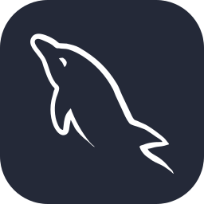
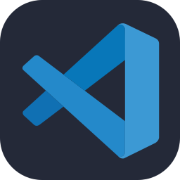
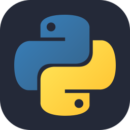
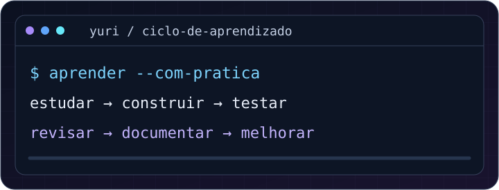

  

  

  
  &nbsp;
  
  &nbsp;
  

  <strong>
    <a href="#sobre-mim">Sobre mim</a> ·
    <a href="#tecnologias">Tecnologias</a> ·
    <a href="#aprendizado">Aprendizado</a> ·
    <a href="#projetos">Projetos</a> ·
    <a href="#contato">Contato</a>
  </strong>

---

# Quem sou eu

Sou o **Yuri**, estudante de **Desenvolvimento de Sistemas**, construindo minha base em programação com foco em **Engenharia de Software**. Quero transformar o que aprendo em projetos úteis e acompanhar minha evolução por aqui.

| Formação | Informação |
| :--- | :--- |
| **País** | Brasil |
| **Instituição** | Centro Paula Souza |
| **Escola** | ETEC Vereador Valdivino Marcusso |
| **Curso** | Desenvolvimento de Sistemas |

---

# Tecnologias que utilizo

## Desenvolvimento

  
  
  

**HTML · CSS · JavaScript**

## Banco de dados

  

**MySQL**

## Ferramentas

  
  
  

**Git · GitHub · VS Code**

---

# O que quero aprender e aprofundar

  
  
  

- **Python:** aprender a linguagem e praticar com pequenos programas.
- **JavaScript:** aprofundar meus conhecimentos e criar interações.
- **Dados:** estudar modelagem, relacionamentos e consultas SQL.
- **Web:** desenvolver projetos cada vez mais completos.
- **Lógica:** fortalecer o raciocínio e a resolução de problemas.

## Minha trilha de estudos

**Lógica → Desenvolvimento web → Dados → Python → Projetos → Engenharia de Software**

---

# Projetos que quero desenvolver

| Ideia | O que quero praticar |
| :--- | :--- |
| **Portfólio pessoal** | Páginas responsivas e apresentação dos meus trabalhos. |
| **Quiz interativo** | Lógica, eventos e pontuação com JavaScript. |
| **Sistema de cadastro** | Validação e organização de dados. |
| **Programas em Python** | Funções e resolução de tarefas simples. |

**[Explorar meus repositórios →](https://github.com/Yuri-Dev1905?tab=repositories)**

---

# Como quero aprender

  

# Meu objetivo

Construir uma base sólida em **Engenharia de Software**, desenvolver projetos próprios e aprender a planejar, testar e melhorar sistemas.

---

# Contato

  
  &nbsp;
  
  &nbsp;
  

  

