<!-- Perfil de Yuri Sampaio Ferreira. Os elementos visuais estão em assets/. -->

  

  

  
  
  

  <strong>
    <a href="#sobre-mim">Sobre mim</a> ·
    <a href="#tecnologias">Tecnologias</a> ·
    <a href="#aprendizado">Aprendizado</a> ·
    <a href="#projetos">Projetos</a> ·
    <a href="#contato">Contato</a>
  </strong>

---

# 👨‍💻 Quem sou eu

### Olá! Eu sou o Yuri.

Sou estudante de **Desenvolvimento de Sistemas** na **ETEC Vereador Valdivino Marcusso**, do **Centro Paula Souza**, no **Brasil**.

Estou construindo minha base em programação e quero seguir na área de **Engenharia de Software**. Meu interesse é entender como uma ideia se transforma em um sistema: desde a lógica e a organização dos dados até o desenvolvimento, os testes e as melhorias.

Uso este perfil para reunir meus estudos, praticar e acompanhar a evolução dos meus projetos.

> **Meu foco:** aprender os fundamentos, desenvolver com atenção e transformar conhecimento em soluções úteis.

## 🎓 Minha formação

| Campo | Informação |
| :--- | :--- |
| **Nome** | Yuri Sampaio Ferreira |
| **País** | 🇧🇷 Brasil |
| **Instituição** | Centro Paula Souza |
| **Escola** | ETEC Vereador Valdivino Marcusso |
| **Curso** | Desenvolvimento de Sistemas |
| **Direção profissional** | Engenharia de Software |

---

# 🛠️ Tecnologias que utilizo

Ferramentas e linguagens que fazem parte dos meus estudos e da construção dos meus projetos.

## 🌐 Desenvolvimento

  
  
  

**HTML · CSS · JavaScript**

Estrutura das páginas, aparência e interatividade no desenvolvimento web.

## 🗄️ Banco de dados

  

**MySQL**

Estudos sobre armazenamento, organização e consulta de informações.

## 🔧 Ferramentas

  
  
  

**Git · GitHub · Visual Studio Code**

Edição de código, controle de versão e organização dos repositórios.

---

# 📚 O que quero aprender e aprofundar

  
  
  

| Área | Meu próximo passo |
| :--- | :--- |
| 🐍 **Python** | Aprender os fundamentos e criar programas para praticar. |
| ⚙️ **JavaScript** | Aprofundar a lógica, trabalhar com a página e desenvolver interações. |
| 🗃️ **Dados** | Estudar modelagem, relacionamentos e consultas SQL. |
| 🌐 **Projetos web** | Unir HTML, CSS e JavaScript em páginas cada vez mais completas. |
| 🧩 **Lógica** | Praticar condições, repetições, funções e resolução de problemas. |
| 🏗️ **Engenharia de Software** | Conhecer requisitos, organização de código, testes e manutenção. |

## 🧭 Minha trilha de estudos

  

Esta é a direção que quero seguir. A ideia é revisar os fundamentos e conectar cada etapa com a prática, avançando conforme meu aprendizado.

---

# 🚀 Projetos que quero desenvolver

Ideias para colocar os estudos em prática e construir meu portfólio.

| Projeto | O que quero praticar |
| :--- | :--- |
| 🌐 **Portfólio pessoal** | Apresentação dos meus trabalhos, organização visual e páginas responsivas. |
| 🧠 **Quiz interativo** | Lógica, eventos, pontuação e respostas ao usuário com JavaScript. |
| 🗂️ **Sistema de cadastro** | Organização de informações, validação e fundamentos de banco de dados. |
| 🐍 **Pequenos programas em Python** | Entrada de dados, funções e resolução de tarefas simples. |

### 📂 Meus repositórios

Meus exercícios e projetos publicados podem ser acompanhados aqui:

**[Explorar os repositórios de Yuri-Dev1905 →](https://github.com/Yuri-Dev1905?tab=repositories)**

---

# 🔄 Como quero evoluir nos estudos

  

1. **Entender o problema:** definir o que o programa precisa resolver.
2. **Praticar em partes:** começar com algo simples e ampliar aos poucos.
3. **Testar e revisar:** observar erros, pesquisar e experimentar soluções.
4. **Registrar o aprendizado:** documentar o projeto e manter o histórico no Git.
5. **Melhorar o resultado:** voltar ao código com o que aprendi no processo.

## 💡 Princípios que quero levar para os projetos

- **Clareza:** escrever código que eu e outras pessoas consigamos entender.
- **Organização:** cuidar dos arquivos, dos nomes e das responsabilidades de cada parte.
- **Qualidade:** testar o funcionamento e tratar os erros com atenção.
- **Colaboração:** compartilhar dúvidas, ouvir sugestões e aprender em equipe.

---

# 🎯 Meu objetivo profissional

Quero construir uma base sólida para atuar com **Engenharia de Software**, combinando programação, entendimento de problemas e desenvolvimento de sistemas.

Neste momento, meus objetivos são fortalecer a lógica, aprofundar o desenvolvimento web e os dados e criar projetos que mostrem minha evolução.

### O que quero construir ao longo dessa jornada

- Um portfólio com projetos próprios e bem documentados.
- Mais autonomia para pesquisar e resolver problemas.
- Conhecimento para planejar, desenvolver, testar e melhorar sistemas.
- Experiência de aprendizado e colaboração em projetos de tecnologia.

---

# 📫 Vamos conversar?

Para trocar ideias sobre programação, estudos e projetos:

  
  
  

  <a href="https://www.instagram.com/yuri.xdk/"><strong>@yuri.xdk</strong></a> ·
  <a href="https://www.linkedin.com/in/yurisampaio1905/"><strong>Yuri Sampaio</strong></a> ·
  <a href="https://github.com/Yuri-Dev1905"><strong>Yuri-Dev1905</strong></a>

 

  

