<h1 align="center">Yuri Sampaio Ferreira</h1>

  <strong>Estudante de Desenvolvimento de Sistemas · Foco em Engenharia de Software</strong>

  

  <a href="#-quem-sou-eu">Sobre mim</a> ·
  <a href="#-tecnologias-utilizadas">Tecnologias</a> ·
  <a href="#-tecnologias-e-conhecimentos-que-busco-aprender">Aprendizado</a> ·
  <a href="#-contato">Contato</a>

## 👋 Quem sou eu

Olá! Sou o **Yuri**, estudante de **Desenvolvimento de Sistemas** na **ETEC Vereador Valdivino Marcusso**, do **Centro Paula Souza**, no Brasil.

Estou construindo minha base em programação e direcionando meus estudos para a **Engenharia de Software**. Quero entender como planejar, desenvolver e melhorar sistemas, colocando o que aprendo em prática por meio de projetos.

| Formação e interesses | Sobre mim |
| :--- | :--- |
| 🌎 País | Brasil |
| 🏛️ Instituição | Centro Paula Souza |
| 🏫 Escola | ETEC Vereador Valdivino Marcusso |
| 💻 Curso | Desenvolvimento de Sistemas |
| 🎯 Foco atual | Engenharia de Software |

## 🛠️ Tecnologias utilizadas

Estas são as tecnologias e ferramentas que utilizo nos meus estudos e projetos.

<table>
  <tr>
    <th align="center">Desenvolvimento</th>
    <th align="center">Banco de dados</th>
    <th align="center">Ferramentas</th>
  </tr>
  <tr>
    <td align="center">
       
      HTML · CSS · JavaScript
    </td>
    <td align="center">
       
      MySQL
    </td>
    <td align="center">
       
      Git · GitHub · VS Code
    </td>
  </tr>
</table>

## 🌱 Tecnologias e conhecimentos que busco aprender

  

| Área | Meu objetivo |
| :--- | :--- |
| 🐍 **Python** | Aprender a linguagem e praticar com pequenos projetos. |
| ⚙️ **JavaScript** | Aprofundar meus conhecimentos e criar páginas mais interativas. |
| 🗃️ **Dados** | Entender melhor a organização dos dados, os bancos relacionais e as consultas SQL. |
| 🌐 **Desenvolvimento web** | Desenvolver projetos que unam estrutura, estilo e funcionalidade. |
| 🧩 **Lógica de programação** | Fortalecer meu raciocínio e a resolução de problemas com exercícios e desafios. |

## 🧭 Meus próximos passos

- Transformar os conteúdos do curso em projetos próprios.
- Praticar organização de código, documentação e controle de versão.
- Estudar os fundamentos da Engenharia de Software, incluindo requisitos, testes e manutenção.
- Construir um portfólio que mostre minha evolução como desenvolvedor.

## 📂 Projetos e estudos

Quero usar este espaço para compartilhar exercícios, projetos e os aprendizados da minha formação em Desenvolvimento de Sistemas.

**[Explore meus repositórios →](https://github.com/Yuri-Dev1905?tab=repositories)**

## 📫 Contato

Vamos conversar sobre programação, estudos e projetos!

<table>
  <tr>
    <td align="center">
      <a href="https://www.instagram.com/yuri.xdk/">
         
        <strong>Instagram</strong>
      </a> 
      @yuri.xdk
    </td>
    <td align="center">
      <a href="https://www.linkedin.com/in/yurisampaio1905/">
         
        <strong>LinkedIn</strong>
      </a> 
      Yuri Sampaio
    </td>
    <td align="center">
      <a href="https://github.com/Yuri-Dev1905">
         
        <strong>GitHub</strong>
      </a> 
      Yuri-Dev1905
    </td>
  </tr>
</table>

 

  

